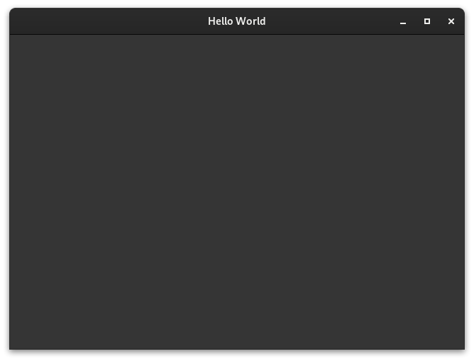
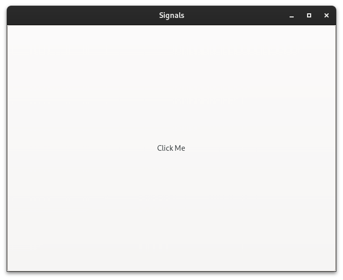

# GTK 4.10 Examples

## Dependencies

Arch:

```
sudo pacman -Sy gcc make pkg-config gtk4
```

Debian/Ubuntu:

```
sudo apt update && sudo apt install gcc make pkg-config libgtk-4-dev
```

## Examples

### Hello World

Creating a window.



### Signals

Create a window containing a button, and bind a method to the button's `clicked` signal.



## Generating Screenshots

Build each example, run it, and take a screenshot of the window.

```
$ scripts/screenshots.sh
```
